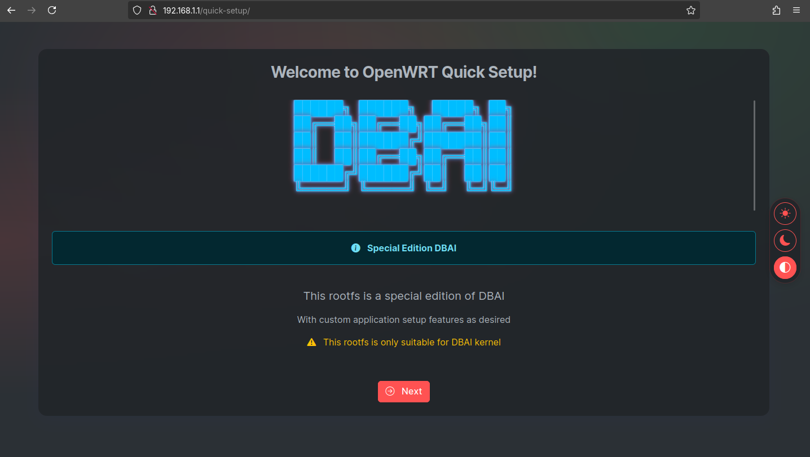
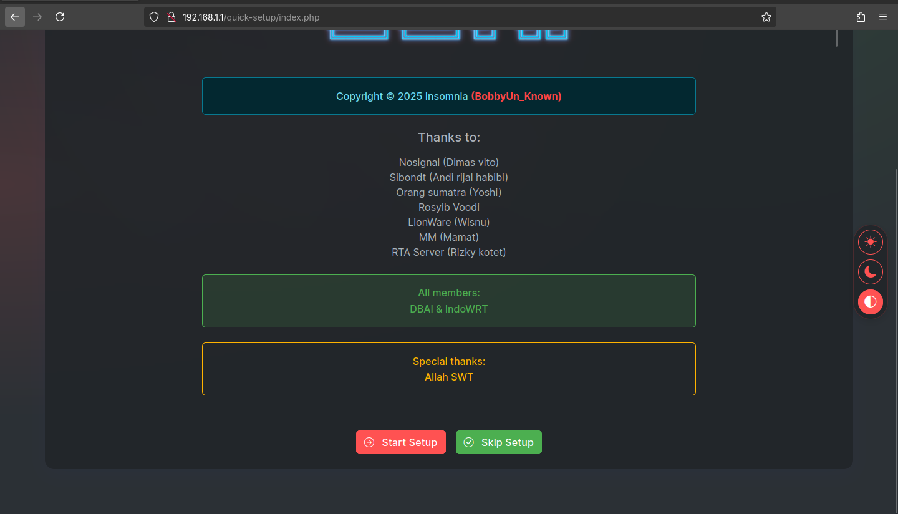
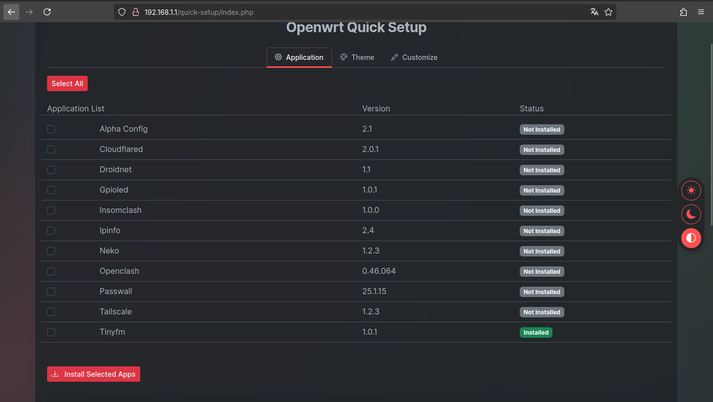
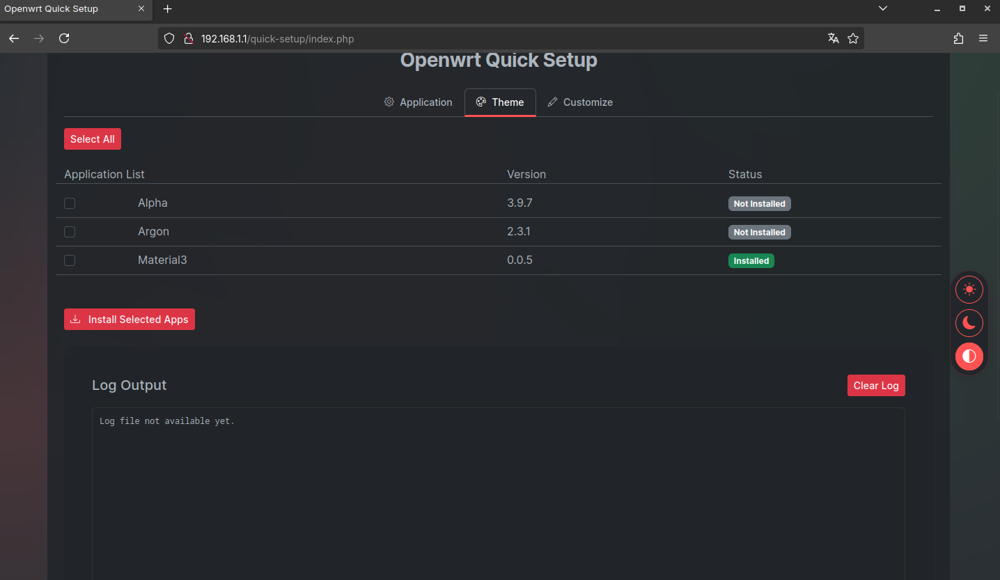
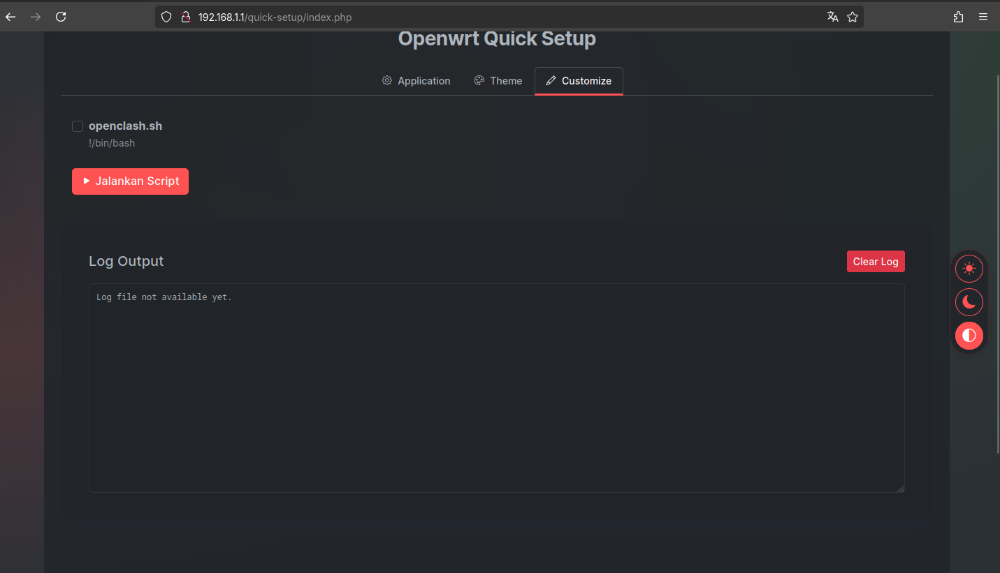
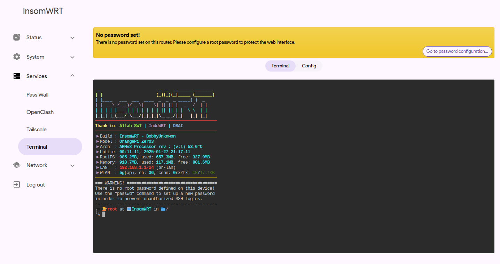
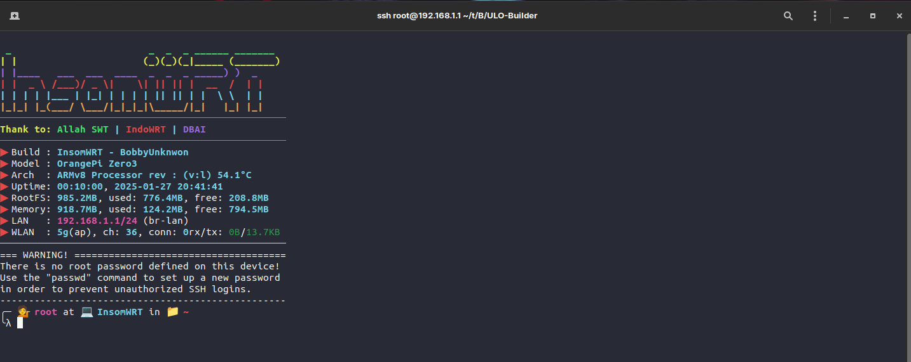

# InsomWRT

### Telegram group:

**OpenWRT untuk perangkat berbasis ARM**

## Openwrt 23.05.05 stable

>Firmware ini di build tanpa aplikasi apapun, Hanya di install depedensi yang di butuhkan untuk ipk yang akan di install di quick setup.  
Jadi user bisa install sendiri ipk yang di butuhkan di quick setup.  
Jika ingin membuka luci bisa akses di **http://192.168.1.1/cgi-bin/luci/**  

***Note:***  
Jika tidak masuk di quick setup clear cache browser atau http://192.168.1.1/quick-setup

### Fitur
- Quick setup
- Wifi on
- Oh my bash
- Tema material3 by [AngelaCooljx](https://github.com/AngelaCooljx/luci-theme-material3 "AngelaCooljx")
- Led,hat
- Dll

 ### Amlogic
     s905x (HG680P, B860Hv1/v2)
     s905x2 (HG680FJ, B860Hv5, MNC CYBORG001)
     s905x3 
     s905x4 (AKARI AX810, dll)

 ### Allwinner
     H5 (Orange Pi Zero Plus 2, Orange Pi Zero Plus, Orange Pi Prime, Orange Pi PC2)
     H6 (Orange Pi 1 Plus, Orange Pi Lite 2, Orange Pi 3 LTS, Orange Pi 3)
     H616 (Orange Pi Zero 2)
     H618 (Orange Pi Zero 3, Orange Pi Zero 2W)

 ### Rockchip
     RK3566 (Orange Pi 3B)
     RK3588S (Orange Pi 5)
     RK3588 (Orange Pi 5 Plus)

**Login:**
- user: root
- pass: tidakadapassword

## Thank to:
- Allah SWT
- DBAI
- IndoWRT

## Screenshot:

Klik untuk melihat screenshot

## Support me:

## Build
Menggunakan [ULO-Builder](https://github.com/armarchindo/ULO-Builder)
