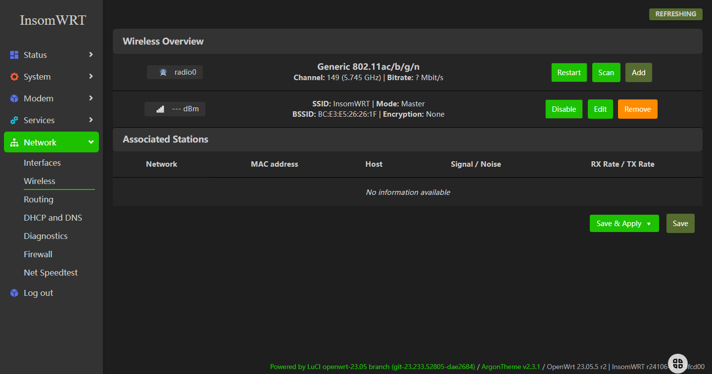
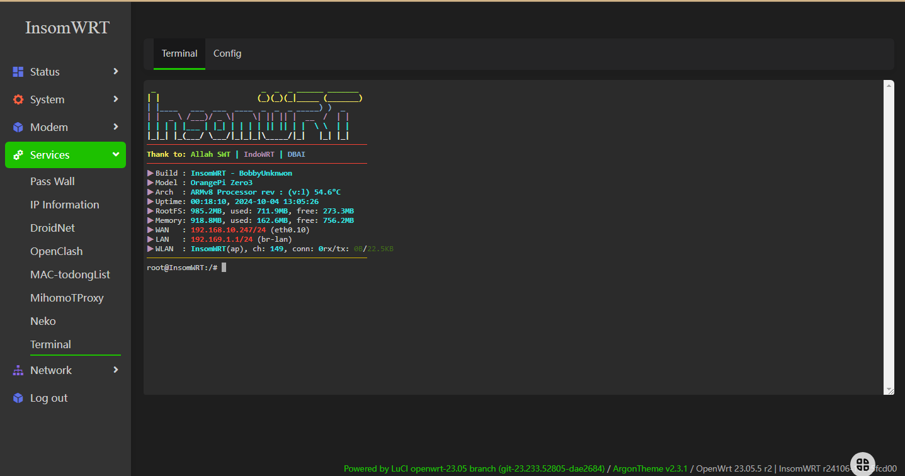
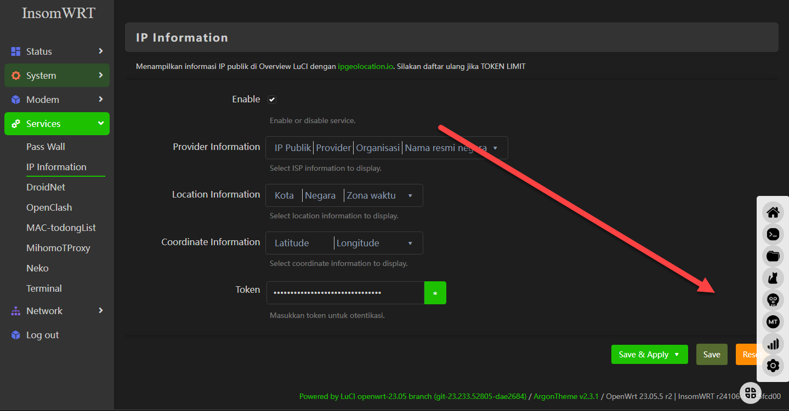
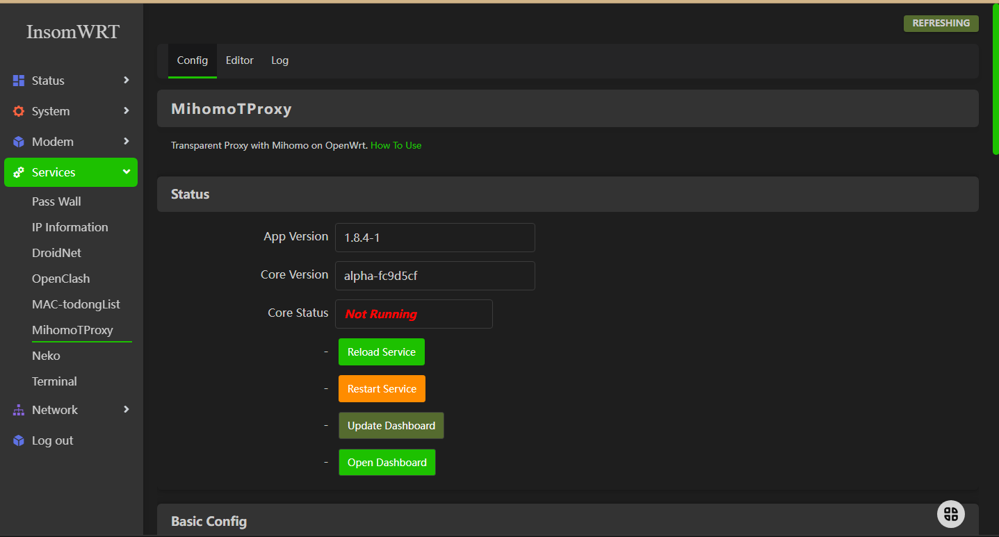
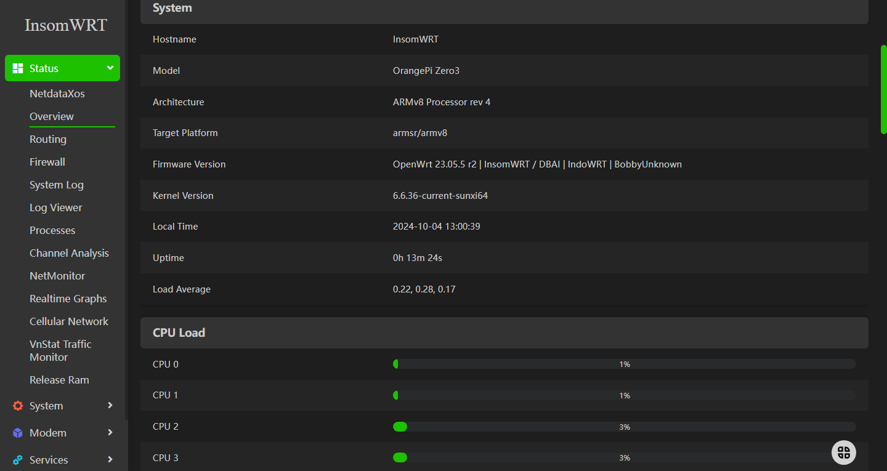
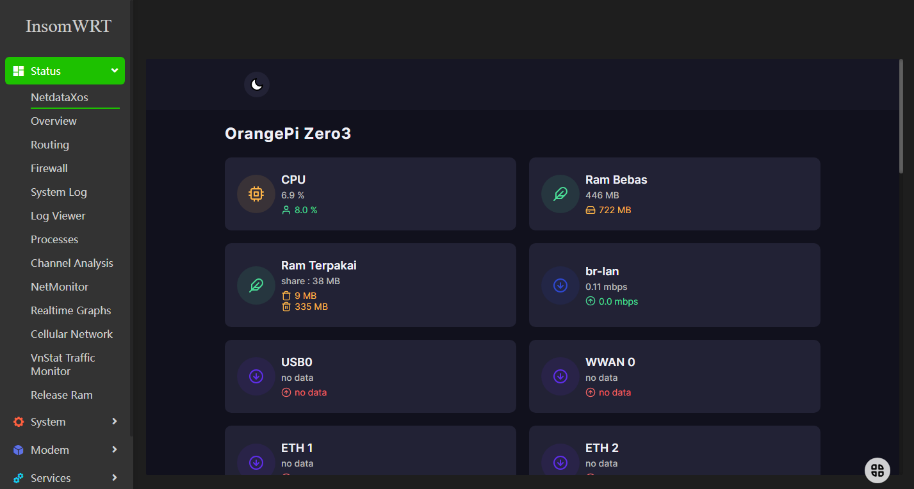
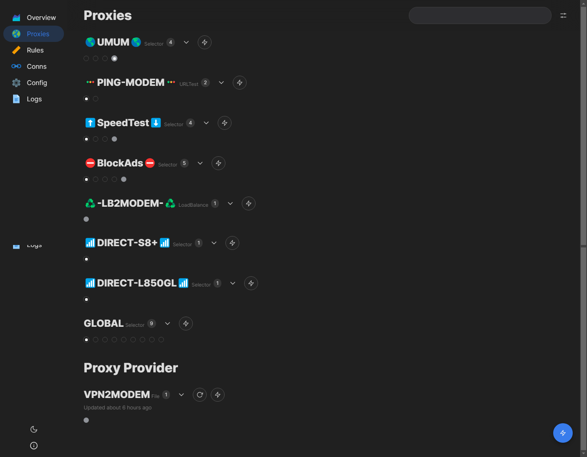

<h1>InsomWRT</h1>

Share firmware openwrt 23.05.05 
B860H WIFI ON sudah test 
OPIZ 3 WIFI ON sudah test 
H680P belum test gak punya device nya

Sudah di tambahkan

Netdata xos "maaf saya buang menu karna suka melebar" 
Log viewer 
Vnstat 
Filemanagar "bisa search file" 
Theme argon + config "sudah di tambahkan menu" 
Rakitan manager 
3ginfo lite 
modemband 
Modeminfo 
SMSTool 
Droidnet 
IPinfo 
Mactodong 
Netspeedtest "local & online" 
Speedtest CLI ketik "speedtest.net" 
ModemManager auto reconnect "by radenku"

Tunnel 
Nekoclash 
Openclash 
Passwall 
MihomoTproxy

user:root 
pass:dbai

Thank to: 
Allah SWT 
DBAI "Terima kasih banyak sepepuh bantu fix wifi" 
IndoWRT

 

Screenshoot:

Klik untuk melihat screenshot

<h2 align="center">Support me:</h2>

  
  

